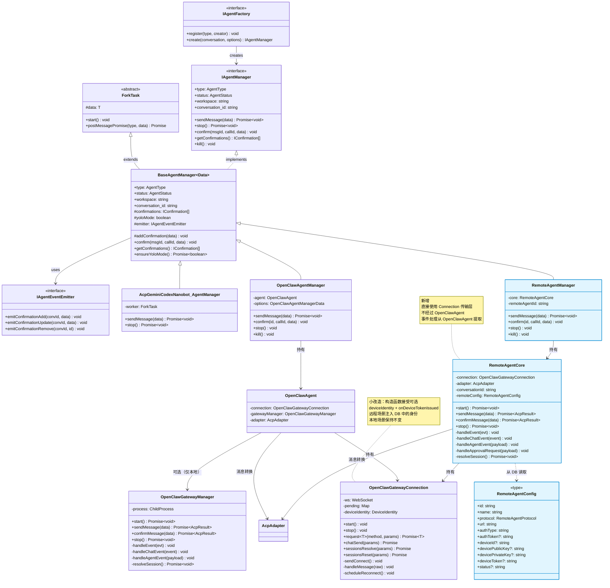
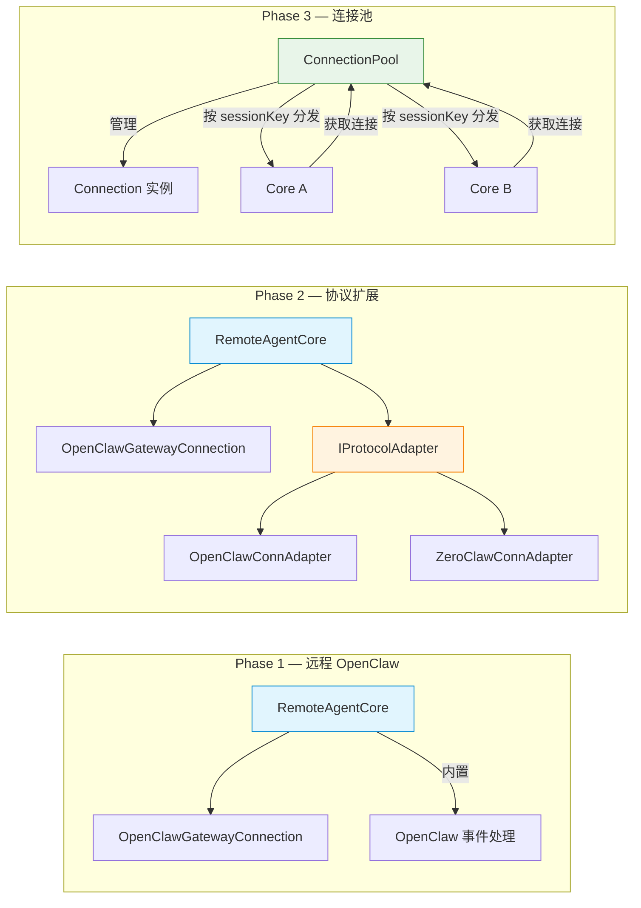

# Remote Agent — 实现方案设计

> 日期：2026-03-24
> 前置文档：[调研报告](./research.md) · [架构分析](./architecture-analysis.md) · [需求文档](./requirements.md)

## 1. 核心约束

1. **不影响现有本地 Agent**：gemini / acp / codex / openclaw-gateway / nanobot 全部保持原样
2. **多实例**：用户可配置 N 个远程 Agent 实例（如 4 个 OpenClaw 分布在 3 台服务器上）
3. **多会话**：同一远程实例可同时服务多个 conversation（不同 session）
4. **存储独立**：远程 Agent 配置存 SQLite，不依赖本地 `~/.openclaw/` 等配置
5. **设备身份隔离**：每个远程 Agent 拥有独立 Ed25519 密钥对，存 DB，不共享 `~/.openclaw/identity/`
6. **复用现有能力**：复用 `OpenClawGatewayConnection`（传输层）、`AcpAdapter`、确认管理、IPC 消息流
7. **组合式新建**：新建 `RemoteAgentCore`，不经过 `OpenClawAgent`，为 Phase 2/3 预留扩展点

## 2. 数据模型

### 2.1 远程 Agent 实例表（新增）

一条记录 = 一个远程 Agent 服务端实例（如一个运行在 `wss://server-a.example.com:18789` 的 OpenClaw Gateway）。

```sql
CREATE TABLE IF NOT EXISTS remote_agents (
  id TEXT PRIMARY KEY,                        -- UUID
  name TEXT NOT NULL,                         -- 用户自定义名称，如 "办公室 OpenClaw"
  protocol TEXT NOT NULL DEFAULT 'openclaw',  -- 协议类型：'openclaw' | 'zeroclaw' | 'acp' | ...
  url TEXT NOT NULL,                          -- 连接地址：ws(s):// 或 http(s)://
  auth_type TEXT NOT NULL DEFAULT 'bearer',   -- 认证类型：'bearer' | 'password' | 'none'
  auth_token TEXT,                            -- Bearer Token 或密码（加密存储）
  avatar TEXT,                                -- emoji 或图片路径
  description TEXT,                           -- 用户备注
  device_id TEXT,                             -- Ed25519 公钥 SHA256 指纹（每个 agent 独立）
  device_public_key TEXT,                     -- Ed25519 公钥 PEM
  device_private_key TEXT,                    -- Ed25519 私钥 PEM（敏感，考虑加密）
  device_token TEXT,                          -- Gateway 签发的设备令牌（hello-ok 后自动写回）
  status TEXT DEFAULT 'unknown',              -- 最后已知状态：'unknown' | 'connected' | 'pending' | 'error'
  last_connected_at INTEGER,                  -- 最后连接成功时间
  created_at INTEGER NOT NULL,
  updated_at INTEGER NOT NULL
);

CREATE INDEX IF NOT EXISTS idx_remote_agents_protocol ON remote_agents(protocol);
```

**设计要点**：

- `protocol` 字段决定使用哪种协议适配器。第一期仅实现 `'openclaw'`, 未来可扩展到其他协议。
- `auth_type` + `auth_token` 组合覆盖 Bearer Token / Password 等模式
- `device_*` 四列是 **OpenClaw 协议特有**的，仅 `protocol = 'openclaw'` 的记录会填充，其他协议保持 `NULL`：
  - `device_id` / `device_public_key` / `device_private_key`：每个远程 Agent 独立的 Ed25519 设备身份，创建时自动生成，**不共享 `~/.openclaw/identity/`**，避免与本地 OpenClaw 安装冲突
  - `device_token`：Gateway 在 `hello-ok` 中签发的设备令牌，后续连接时优先使用此 token（优先级高于 `auth_token`）
- `status` 新增 `'pending'`：表示设备已提交配对但 Gateway 端尚未批准
- **这张表只存实例配置**，不存 conversation。conversation 仍在 `conversations` 表中

### 2.2 conversations 表扩展

```sql
-- DB migration: 新增 'remote' 到 type CHECK 约束
-- SQLite 不支持 ALTER CHECK，需要重建表或去掉 CHECK（推荐去掉 CHECK，用应用层校验）
```

**实际做法**：参照现有迁移模式，去掉 `type` 的 CHECK 约束（或重建表添加 `'remote'`）。

### 2.3 TypeScript 类型

```typescript
// agentTypes.ts
export type AgentType = 'gemini' | 'acp' | 'codex' | 'openclaw-gateway' | 'nanobot' | 'remote';

// 新增：远程 Agent 协议类型
export type RemoteAgentProtocol = 'openclaw' | 'zeroclaw' | 'acp';

// 新增：远程 Agent 实例配置（对应 remote_agents 表）
export type RemoteAgentConfig = {
  id: string;
  name: string;
  protocol: RemoteAgentProtocol;
  url: string;
  authType: 'bearer' | 'password' | 'none';
  authToken?: string;
  avatar?: string;
  description?: string;
  // 设备身份（每个远程 Agent 独立，创建时自动生成）
  deviceId?: string; // Ed25519 公钥 SHA256 指纹
  devicePublicKey?: string; // Ed25519 公钥 PEM
  devicePrivateKey?: string; // Ed25519 私钥 PEM
  deviceToken?: string; // Gateway 签发的设备令牌
  status?: 'unknown' | 'connected' | 'pending' | 'error';
  lastConnectedAt?: number;
  createdAt: number;
  updatedAt: number;
};
```

```typescript
// storage.ts — TChatConversation 新增分支
| Omit<
    IChatConversation<
      'remote',
      {
        workspace?: string;
        remoteAgentId: string;       // 关联 remote_agents.id
        sessionKey?: string;         // 远程 session key，用于恢复
        enabledSkills?: string[];
        presetAssistantId?: string;
        pinned?: boolean;
        pinnedAt?: number;
      }
    >,
    'model'
  >
```

**关键**：`remoteAgentId` 关联到 `remote_agents` 表。创建 conversation 时从该表读取 URL/Token/Protocol，而不是在 conversation extra 中重复存储连接信息。这样用户修改远程 Agent 的 URL 或 Token 后，所有关联 conversation 自动生效。

### 2.4 本地 OpenClaw vs 远程 OpenClaw 的关系

```
conversations 表
├── type='openclaw-gateway'  → 本地 OpenClaw（走现有逻辑，不变）
│     extra.gateway.host = 'localhost'
│     extra.gateway.port = 18789
│     可选 useExternalGateway
│
└── type='remote'            → 远程 Agent（新逻辑）
      extra.remoteAgentId → remote_agents 表
      remote_agents.protocol = 'openclaw'
      remote_agents.url = 'wss://server-a:18789'
```

**两者完全独立**。`openclaw-gateway` 类型的行为完全不变。

## 3. 连接架构

### 3.1 每个 conversation 独立连接

```
Conversation A (remote, agent=server-a) → RemoteAgentCore → OpenClawGatewayConnection → wss://server-a:18789
Conversation B (remote, agent=server-a) → RemoteAgentCore → OpenClawGatewayConnection → wss://server-a:18789
Conversation C (remote, agent=server-b) → RemoteAgentCore → OpenClawGatewayConnection → wss://server-b:42617
```

**第一期不做连接共享**。理由：

- OpenClaw Gateway 天然支持多客户端连接
- 每个 conversation 有独立的 session key，不会冲突
- 独立连接的生命周期管理更简单（conversation 关闭 = 连接断开）

Phase 3 可引入 ConnectionPool，`RemoteAgentCore` 本就不拥有连接生命周期，届时改为从 pool 获取即可。

### 3.2 认证流程（远程 OpenClaw）

#### 3.2.1 握手时序

```
AionUi                                Remote OpenClaw Gateway
  |                                          |
  |--- WS Connect (no auth header) --------->|
  |<-- EVENT connect.challenge {nonce} ------|
  |                                          |
  |--- REQ connect {                    ---->|
  |      auth: { token: <device_token        |  ← 优先 remote_agents.device_token
  |               ?? auth_token> },          |  ← 回退 remote_agents.auth_token
  |      device: {                           |
  |        id: <device_id>,                  |  ← 从 remote_agents.device_id 读取
  |        publicKey: <device_public_key>,   |  ← 从 remote_agents.device_public_key 读取
  |        signature: sign(nonce, privKey),  |  ← 用 remote_agents.device_private_key 签名
  |        signedAt, nonce                   |
  |      },                                  |
  |      caps: ['tool-events'],              |
  |    }                                     |
  |                                          |
  |<-- RES { ok: true, payload: HelloOk } ---|  ← 成功：设备被接受
  |    或                                    |
  |<-- RES { ok: false, error: {             |  ← 失败：需要区分错误类型
  |      details: {                          |
  |        code, recommendedNextStep,        |
  |        canRetryWithDeviceToken           |
  |      }                                   |
  |    }} -----------------------------------|
  |                                          |
  |--- REQ sessions.reset/resolve ---------->|  ← 用 conversation_id 作为 session key
  |<-- RES { key, sessionId } ---------------|
  |                                          |
  |  （正常对话流）                          |
```

#### 3.2.2 设备身份管理

**与本地 OpenClaw 的关键差异**：

| 方面             | 本地 OpenClaw                                  | 远程 Agent                                   |
| ---------------- | ---------------------------------------------- | -------------------------------------------- |
| 设备密钥对       | `~/.openclaw/identity/device.json`（全局共享） | `remote_agents` 表（每个 Agent 独立密钥对）  |
| 设备令牌         | `~/.openclaw/identity/device-auth.json`        | `remote_agents.device_token` 列              |
| 密钥对生成时机   | 首次使用 `loadOrCreateDeviceIdentity()` 时     | `remoteAgent.create` IPC 调用时（保存到 DB） |
| URL / Token 来源 | `~/.openclaw/config.json`                      | `remote_agents` 表                           |
| 本地进程管理     | `OpenClawGatewayManager` 启动本地 Gateway 进程 | 无（纯远程）                                 |

#### 3.2.3 OpenClawGatewayConnection 改造

构造函数新增可选 `deviceIdentity` 参数：

```typescript
// OpenClawGatewayConnection constructor 变更
constructor(opts: OpenClawGatewayClientOptions) {
  // 如果外部传入 deviceIdentity，使用外部的（远程 Agent 场景）
  // 否则从 ~/.openclaw/identity/ 加载（本地 Gateway 场景，兼容不变）
  this.deviceIdentity = opts.deviceIdentity ?? loadOrCreateDeviceIdentity();
  // ...
}
```

新增可选回调用于 device token 持久化：

```typescript
interface OpenClawGatewayClientOptions {
  // ...existing fields...
  deviceIdentity?: DeviceIdentity; // 外部注入设备身份
  onDeviceTokenIssued?: (token: string) => void; // device token 签发回调
}
```

- 远程场景：`RemoteAgentCore` 传入 DB 中的 `DeviceIdentity`，`onDeviceTokenIssued` 回写 DB
- 本地场景：不传 `deviceIdentity`（从文件加载），不传回调（写文件，现有逻辑不变）

#### 3.2.4 配对审批处理

```
用户点击保存
     │
     ▼
remoteAgent.handshake IPC
     │
     ├─ 创建 OpenClawGatewayConnection（使用 DB 中的设备身份）
     ├─ 等待 connect.challenge → 签名 → 发送 connect
     │
     ├─ hello-ok ──────────────► { status: 'ok' }
     │   └─ 保存 deviceToken 到 DB
     │
     ├─ 错误 + recommendedNextStep='wait_then_retry'
     │   └──────────────────────► { status: 'pending_approval' }
     │
     └─ 其他错误 ──────────────► { status: 'error', error: '...' }
```

UI 收到 `pending_approval` 后：

- Modal 切换为"等待审批"界面（spinner + 提示文字 + 剩余时间倒计时 + 取消按钮）
- 每 5 秒调用 `remoteAgent.handshake` 重试，**最长轮询 5 分钟**（Gateway 端配对请求 5 分钟过期）
- 审批通过（返回 `ok`）→ 保存配置，关闭 Modal
- 5 分钟超时 → 停止轮询，提示"审批已过期，请在 Gateway 端重新发起"，保存配置（status='pending'）
- 用户手动取消 → 停止轮询，保存配置（status='pending'），关闭 Modal

**为什么不用长连接等待？**

- OpenClaw 协议中，connect 被拒绝后 Gateway 会关闭 WebSocket，不保持连接
- 客户端必须重新建立连接来重试
- 轮询间隔 5s，最多 60 次（5 分钟），与 Gateway 审批过期窗口对齐

### 3.3 协议适配预留

```typescript
// 第一期：仅实现 OpenClaw，事件处理内置于 RemoteAgentCore
// 第二期：提取为 IProtocolAdapter 接口，按 protocol 字段切换

// 伪代码示意（Phase 2）
function createProtocolAdapter(protocol: RemoteAgentProtocol): IProtocolAdapter {
  switch (protocol) {
    case 'openclaw':
      return new OpenClawProtocolAdapter();
    case 'zeroclaw':
      return new ZeroClawProtocolAdapter();
    default:
      throw new UnsupportedProtocolError(protocol);
  }
}
```

## 4. 代码结构

### 4.1 类关系图



**要点**：

- `RemoteAgentManager` 持有 `RemoteAgentCore`（新类），**不经过** `OpenClawAgent`
- `RemoteAgentCore` 直接使用 `OpenClawGatewayConnection`（传输层复用），自行处理事件
- 本地链路 `OpenClawAgentManager → OpenClawAgent → Connection` **完全不变**
- 远程链路 `RemoteAgentManager → RemoteAgentCore → Connection` 是**独立的新链路**
- `RemoteAgentCore` 是 `OpenClawAgent` 的远程版本：相同的协议处理能力，但不管理本地进程

### 4.2 Phase 演进路径



### 4.3 新增文件

```
src/process/agent/remote/
├── RemoteAgentCore.ts           远程 Agent 核心类（OpenClawAgent 的远程版本）
├── types.ts                     远程 Agent 相关类型（RemoteAgentConfig 等）
└── index.ts                     导出

src/process/task/
└── RemoteAgentManager.ts        IAgentManager 实现
```

### 4.4 RemoteAgentCore

`OpenClawAgent` 的远程版本。直接使用 `OpenClawGatewayConnection` 传输层，自行处理 OpenClaw Gateway 事件。

与 `OpenClawAgent` 的差异：

- 不持有 `OpenClawGatewayManager`（不管理本地进程）
- 不读取本地 `~/.openclaw/` 配置（从 `RemoteAgentConfig` 获取 URL/Token）
- 不检测本地端口、不启动本地 Gateway 进程
- 事件处理逻辑从 `OpenClawAgent` 提取（约 300 行），功能相同

```typescript
// 简化示意，非最终代码
class RemoteAgentCore {
  private connection: OpenClawGatewayConnection | null = null;
  private adapter: AcpAdapter;

  constructor(
    private readonly conversationId: string,
    private readonly remoteConfig: RemoteAgentConfig,
    private readonly callbacks: {
      onStreamEvent: (data: IResponseMessage) => void;
      onSignalEvent?: (data: IResponseMessage) => void;
      onSessionKeyUpdate?: (sessionKey: string) => void;
    }
  ) {
    this.adapter = new AcpAdapter(conversationId, 'remote');
  }

  async start(): Promise<void> {
    // 直接创建 WS 连接（无本地进程管理）
    this.connection = new OpenClawGatewayConnection({
      url: this.remoteConfig.url,
      token: this.remoteConfig.authType === 'bearer' ? this.remoteConfig.authToken : undefined,
      password: this.remoteConfig.authType === 'password' ? this.remoteConfig.authToken : undefined,
      // 注入 DB 中的设备身份（不使用 ~/.openclaw/identity/）
      deviceIdentity: this.remoteConfig.deviceId
        ? {
            deviceId: this.remoteConfig.deviceId,
            publicKeyPem: this.remoteConfig.devicePublicKey!,
            privateKeyPem: this.remoteConfig.devicePrivateKey!,
          }
        : undefined,
      // device token 签发后写回 DB
      onDeviceTokenIssued: (token) => this.updateDeviceToken(token),
      onEvent: (evt) => this.handleEvent(evt),
      onHelloOk: (hello) => this.handleHelloOk(hello),
      onConnectError: (err) => this.handleConnectError(err),
      onClose: (code, reason) => this.handleClose(code, reason),
    });
    this.connection.start();
    await this.waitForConnection();
    await this.resolveSession();
  }

  async sendMessage(data: { content: string; files?: string[] }): Promise<AcpResult> {
    // 与 OpenClawAgent.sendMessage 逻辑相同
  }

  async confirmMessage(data: { confirmKey: string; callId: string }): Promise<AcpResult> {
    // 与 OpenClawAgent.confirmMessage 逻辑相同
  }

  async stop(): Promise<void> {
    this.connection?.stop();
    this.connection = null;
  }

  // ===== 事件处理（从 OpenClawAgent 提取，逻辑相同） =====
  private handleEvent(evt: EventFrame): void {
    /* ... */
  }
  private handleChatEvent(event: ChatEvent): void {
    /* ... */
  }
  private handleAgentEvent(payload: unknown): void {
    /* ... */
  }
  private handleApprovalRequest(payload: unknown): void {
    /* ... */
  }
  private resolveSession(): Promise<void> {
    /* ... */
  }
}
```

### 4.5 RemoteAgentManager

继承 `BaseAgentManager`，持有 `RemoteAgentCore`。结构与 `OpenClawAgentManager` 平行。

```typescript
// 简化示意，非最终代码
class RemoteAgentManager extends BaseAgentManager<RemoteAgentManagerData> {
  private core!: RemoteAgentCore;
  private bootstrap: Promise<RemoteAgentCore>;

  constructor(data: RemoteAgentManagerData) {
    super('remote', data, new IpcAgentEventEmitter());
    this.conversation_id = data.conversation_id;
    this.workspace = data.workspace ?? '';
    this.bootstrap = this.initCore(data);
  }

  private async initCore(data: RemoteAgentManagerData): Promise<RemoteAgentCore> {
    // 从 DB 读取远程 Agent 配置
    const remoteConfig = db.getRemoteAgent(data.remoteAgentId);

    this.core = new RemoteAgentCore(data.conversation_id, remoteConfig, {
      onStreamEvent: (msg) => this.handleStreamEvent(msg),
      onSignalEvent: (msg) => this.handleSignalEvent(msg),
      onSessionKeyUpdate: (key) => this.handleSessionKeyUpdate(key),
    });

    await this.core.start();
    return this.core;
  }

  async sendMessage(data: { content: string; msg_id?: string; files?: string[] }) {
    cronBusyGuard.setProcessing(this.conversation_id, true);
    this.status = 'running';
    await this.bootstrap;

    // 保存用户消息到 DB
    if (data.msg_id && data.content) {
      addMessage(this.conversation_id /* userMessage */);
    }

    await this.core.sendMessage({ content: data.content, files: data.files });
  }

  async confirm(id: string, callId: string, data: string) {
    super.confirm(id, callId, data);
    await this.bootstrap;
    await this.core.confirmMessage({ confirmKey: data, callId });
  }

  // handleStreamEvent / handleSignalEvent / handleSessionKeyUpdate
  // → 与 OpenClawAgentManager 逻辑相同：
  //   - 持久化消息到 DB
  //   - emit 到 ipcBridge.conversation.responseStream
  //   - emit 到 channelEventBus
  //   - 处理权限请求（addConfirmation）

  stop() {
    return this.core?.stop() ?? Promise.resolve();
  }
  kill() {
    this.core?.stop().catch(console.error);
    super.kill();
  }
}
```

## 5. 需要修改的现有文件

### 5.1 类型与数据层

| 文件                                          | 修改内容                                                                               | 影响范围               |
| --------------------------------------------- | -------------------------------------------------------------------------------------- | ---------------------- |
| `src/process/task/agentTypes.ts`              | `AgentType` 新增 `'remote'`                                                            | 类型层面，无运行时影响 |
| `src/common/config/storage.ts`                | `TChatConversation` 新增 `'remote'` 分支                                               | 类型层面               |
| `src/common/adapter/ipcBridge.ts`             | `ICreateConversationParams.type` 联合类型新增 `'remote'`                               | IPC 类型               |
| `src/process/services/database/schema.ts`     | `CURRENT_DB_VERSION` + 1（15 → 16）                                                    | 仅版本号               |
| `src/process/services/database/migrations.ts` | 新增 migration v16：建 `remote_agents` 表 + `conversations.type` CHECK 新增 `'remote'` | DB 层面                |
| `src/process/services/database/types.ts`      | DB row `type` 字段类型 + `rowToConversation()` switch 新增 `'remote'` case             | DB 读取层              |

### 5.2 服务与工厂层

| 文件                                                     | 修改内容                                                            | 影响范围     |
| -------------------------------------------------------- | ------------------------------------------------------------------- | ------------ |
| `src/process/task/workerTaskManagerSingleton.ts`         | `agentFactory.register('remote', ...)` 注册 `RemoteAgentManager`    | 工厂注册     |
| `src/process/services/ConversationServiceImpl.ts`        | `createConversation()` switch 新增 `'remote'` case                  | 会话创建     |
| `src/process/utils/initAgent.ts`                         | 新增 `createRemoteAgent()` 函数（供 ConversationServiceImpl 调用）  | Agent 初始化 |
| `src/process/bridge/services/ActivitySnapshotBuilder.ts` | activity snapshot type-specific 逻辑新增 `'remote'` case            | 活动快照     |
| `src/process/bridge/conversationBridge.ts`               | 审查多处 `conversation.type !== 'xxx'` 判断，确保 remote 走正确分支 | 会话桥接     |

### 5.3 UI 层

| 文件                                                                    | 修改内容                                                                          | 影响范围        |
| ----------------------------------------------------------------------- | --------------------------------------------------------------------------------- | --------------- |
| `src/renderer/pages/conversation/components/ChatConversation.tsx`       | 渲染 switch 新增 `'remote'` case + model selector 条件分支（remote 无本地 model） | 会话 UI         |
| `src/renderer/hooks/chat/useSendBoxDraft.ts`                            | draft 管理 switch 新增 `'remote'` case                                            | 输入框草稿      |
| `src/renderer/pages/conversation/utils/createConversationParams.ts`     | 参数构建 + `getConversationTypeForBackend()` 新增 `'remote'`                      | Guid 页发起会话 |
| `src/renderer/utils/model/agentLogo.ts`                                 | `AGENT_LOGO_MAP` 新增 remote Agent logo                                           | Agent 头像      |
| `src/renderer/pages/conversation/GroupedHistory/utils/exportHelpers.ts` | `getBackendKeyFromConversation()` 新增 `'remote'` case                            | 导出功能        |
| i18n locale 文件                                                        | remote agent 的显示名称、描述等 i18n key                                          | 国际化          |

### 5.4 新增 UI 组件

| 文件                                                | 说明                                                       |
| --------------------------------------------------- | ---------------------------------------------------------- |
| `src/renderer/pages/conversation/platforms/remote/` | 新建目录，包含 `RemoteChat.tsx` 等（参照 `nanobot/` 结构） |
| `src/renderer/pages/settings/` 对应区域             | Remote Agents 管理 UI（增删改查 + 连接测试）               |

### 5.5 需要小幅修改的文件

| 文件                                                      | 修改内容                                                                                                                        | 影响范围  |
| --------------------------------------------------------- | ------------------------------------------------------------------------------------------------------------------------------- | --------- |
| `src/process/agent/openclaw/OpenClawGatewayConnection.ts` | 构造函数接受可选 `deviceIdentity` 和 `onDeviceTokenIssued` 回调；不传时保持原有行为（从文件加载），传入时使用外部注入的设备身份 | 传输层    |
| `src/process/agent/openclaw/types.ts`                     | `OpenClawGatewayClientOptions` 新增 `deviceIdentity?` 和 `onDeviceTokenIssued?` 字段                                            | 类型定义  |
| `src/common/adapter/ipcBridge.ts`                         | 新增 `remoteAgent.handshake` IPC 方法声明                                                                                       | IPC 类型  |
| `src/process/bridge/remoteAgentBridge.ts`                 | 新增 `remoteAgent.handshake` handler（创建临时连接做完整握手，返回结构化结果）                                                  | Bridge 层 |

### 5.6 不需要修改的文件

- `OpenClawAgent`（index.ts） — 本地 OpenClaw 完全不变
- `OpenClawAgentManager.ts` — 本地 OpenClaw Manager 不变
- `OpenClawGatewayManager.ts` — 远程模式不使用
- `BaseAgentManager.ts` — 基类不变
- 其他 Agent Manager — 完全不涉及
- 消息持久化（`addMessage` 等） — 类型无关，无需修改
- Channel 事件总线（`ChannelEventBus`） — 使用通用 `IResponseMessage`，无需修改
- 搜索功能 — 通用查询，无需修改

## 6. 分阶段实施

### Phase 1 — 远程 OpenClaw（本期）

- [ ] DB migration：`remote_agents` 表（含设备身份字段）+ `conversations.type` 扩展
- [ ] 类型扩展：`AgentType`、`TChatConversation`、`RemoteAgentConfig`（含设备身份字段）
- [ ] `OpenClawGatewayConnection` 改造：接受可选 `deviceIdentity` + `onDeviceTokenIssued`
- [ ] 新增 `RemoteAgentCore`（注入 DB 设备身份，不使用 `~/.openclaw/identity/`）
- [ ] 新增 `RemoteAgentManager`
- [ ] AgentFactory 注册 `'remote'`
- [ ] DB 操作：`remote_agents` CRUD（创建时自动生成 Ed25519 密钥对）
- [ ] IPC：`remoteAgent.handshake`（完整握手，返回结构化结果：ok / pending_approval / error）
- [ ] UI：设置页远程 Agent 管理（增删改查 + 连接测试）
- [ ] UI：保存时触发握手，处理配对审批等待状态（轮询 + 取消）
- [ ] UI：Guid 页展示远程 Agent 选项
- [ ] UI：会话面板连接状态指示

### Phase 2 — 协议扩展（未来）

- [ ] 从 `RemoteAgentCore` 提取 `IProtocolAdapter` 接口
- [ ] 实现 `OpenClawProtocolAdapter`（从 Phase 1 内置逻辑提取）
- [ ] 实现 `ZeroClawProtocolAdapter`
- [ ] UI：远程 Agent 添加时选择协议类型

### Phase 3 — 高级功能（未来）

- [ ] `ConnectionPool`：同一远程实例的多个 conversation 共享连接，按 sessionKey 分发事件
- [ ] 健康检测：定期 ping 远程实例
- [ ] Token 刷新机制
- [ ] 远程文件操作策略（逐次确认 / 白名单）

## 7. 已确认决策

| 问题              | 决策                                                                             |
| ----------------- | -------------------------------------------------------------------------------- |
| URL 格式          | UI 层智能补全，无协议前缀时默认 `wss://`                                         |
| auth_token 加密   | 使用与现有 WebUI JWT secret 相同的加密方式                                       |
| 连接超时          | 第一期全局默认值（连接 30s，请求 60s）                                           |
| 删除远程 Agent 时 | 不级联删除 conversation，仅标记不可用                                            |
| 连接状态 UI       | 参考现有其他 Agent 的实现和定义                                                  |
| 设备身份存储      | 存 `remote_agents` 表，每个远程 Agent 独立密钥对，不使用 `~/.openclaw/identity/` |
| 设备令牌存储      | `hello-ok` 后写回 `remote_agents.device_token`，后续连接优先使用                 |
| 配对审批触发时机  | 保存时（非 testConnection）；testConnection 仅测连通性                           |
| 配对审批轮询间隔  | 5 秒（Gateway 端审批请求 5 分钟过期）                                            |
| 取消审批等待      | 配置仍保存（status='pending'），用户可后续重新触发                               |
