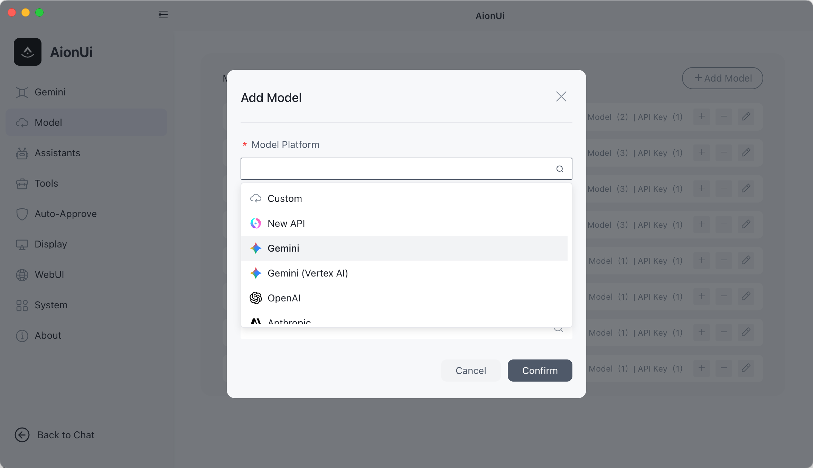
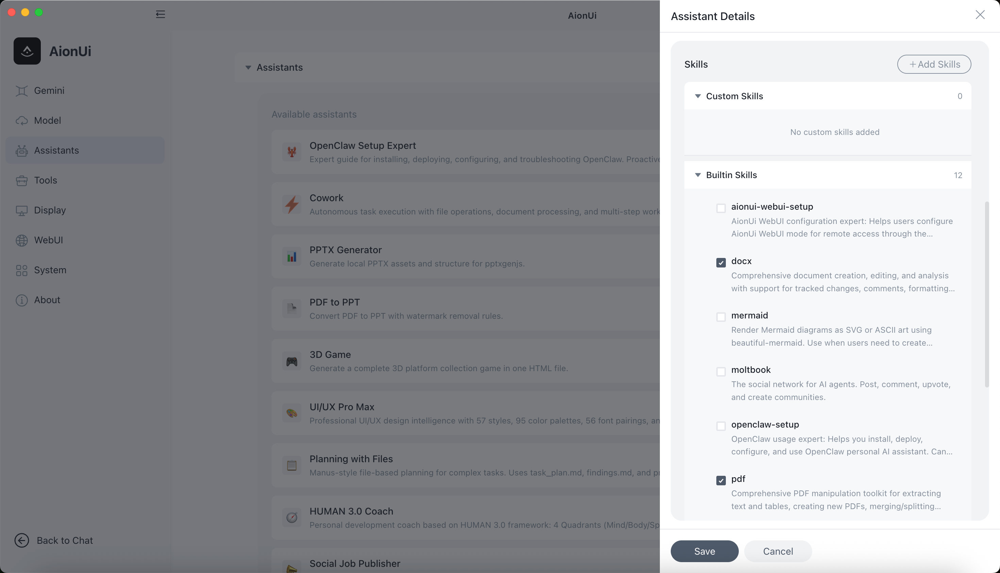
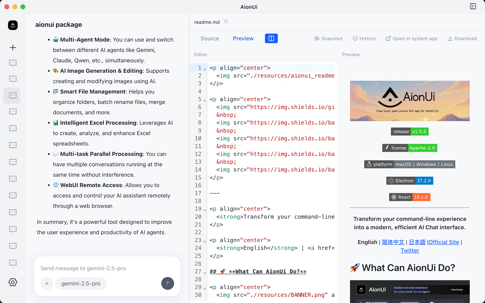

<p align="center">
  
</p>

<p align="center">
  
  &nbsp;
  
  &nbsp;
  
</p>

<p align="center">
  <a href="https://trendshift.io/repositories/15423" target="_blank">
    
  </a>
</p>

---

<p align="center">
  <strong>A free, open-source, Cowork app with AI Agents</strong><br>
  <em>Built-in Agent | Zero Setup | Any API Key | Multi-Agents | Remote Access | Cross-Platform | 24/7 Automation</em>
</p>

<p align="center">
  <a href="https://github.com/iOfficeAI/AionUi/releases">
    
  </a>
</p>

<p align="center">
  <strong>English</strong> | <a href="./docs/readme/readme_ch.md">简体中文</a> | <a href="./docs/readme/readme_tw.md">繁體中文</a> | <a href="./docs/readme/readme_jp.md">日本語</a> | <a href="./docs/readme/readme_ko.md">한국어</a> | <a href="./docs/readme/readme_es.md">Español</a> | <a href="./docs/readme/readme_pt.md">Português</a> | <a href="./docs/readme/readme_tr.md">Türkçe</a> | <a href="https://www.aionui.com" target="_blank">Official Website</a>
</p>

<p align="center">
  <strong>💬 Community:</strong> <a href="https://discord.gg/2QAwJn7Egx" target="_blank">Discord (English)</a> | <a href="./resources/wx-4.png" target="_blank">微信 (中文群)</a> | <a href="https://twitter.com/AionUI" target="_blank">Twitter</a>
</p>

---

## 📋 Quick Navigation

<p align="center">

[✨ Cowork in Action](#-cowork-in-action) ·
[🤔 Why Choose AionUi?](#-why-choose-aionui-over-claude-cowork) ·
[🚀 Quick Start](#-quick-start) ·
[💬 Community](#-community--support)

</p>

---

## Cowork — AI Agents That Work Alongside You

**AionUi is more than a chat client.** It's a Cowork platform where AI agents work alongside you on your computer — reading files, writing code, browsing the web, and automating tasks. You see everything the agent does, and you're always in control.

|                                 | Traditional AI Chat Clients | **AionUi (Cowork)**                                                                          |
| :------------------------------ | :-------------------------- | :------------------------------------------------------------------------------------------- |
| AI can operate on your files    | Limited or No               | **Yes — built-in agent with full file access**                                               |
| AI can execute multi-step tasks | Limited                     | **Yes — autonomous with your approval**                                                      |
| Remote access from phone        | Rarely                      | **WebUI + Telegram / Lark / DingTalk**                                                       |
| Scheduled automation            | No                          | **Cron — 24/7 unattended**                                                                   |
| Multiple AI Agents at once      | No                          | **Claude Code, Codex, OpenClaw, Qwen Code, and 12+ more — auto-detected, unified interface** |
| Price                           | Free / Paid                 | **Free & Open Source**                                                                       |

<p align="center">
  
</p>

---

## Built-in Agent — Install & Go, Zero Configuration

AionUi ships with a complete AI agent engine. Unlike tools that require you to install CLI agents separately, **AionUi works the moment you install it**.

- **No CLI tools to install** — the agent engine is built in
- **No complex setup** — sign in with Google or paste any API key
- **Full agent capabilities** — file read/write, web search, image generation, MCP tools
- **Ready-to-use assistants** — 11+ built-in professional assistants (Cowork, PPTX Generator, PDF to PPT, 3D Game, UI/UX Pro Max, and more) ready to use immediately

<p align="center">
  
</p>

### **Morph PPT Animation Demo — Smooth Transitions from One Prompt**

_AionUi includes a dedicated Morph PPT assistant. It doesn't just build static slides — it turns your content into dynamic, story-driven presentations. Provide a topic/outline (or style reference), and get a Morph deck with coherent transitions. Powered by [OfficeCLI](https://github.com/iOfficeAI/OfficeCli#)._

- **Not a typical PPT generator** — focuses on Morph storytelling with continuous slide-to-slide motion
- **Built-in end-to-end workflow** — planning, generation, quality checks, and iteration
- **Style-aligned co-creation** — use reference images/styles to match your visual taste quickly
- **Generate and preview instantly** — open `.ppt` / `.pptx` in AionUi preview without switching apps

<p align="center">
  
</p>

---

## Multi-Agent Mode — Already Have CLI Agents? Bring Them In

If you already use Claude Code, Codex, or Qwen Code, AionUi auto-detects them and lets you Cowork with all of them — alongside the built-in agent.

**Supported Agents:** Built-in Agent (zero setup) • Claude Code • Codex • Qwen Code • Goose AI • OpenClaw • Augment Code • iFlow CLI • CodeBuddy • Kimi CLI • OpenCode • Factory Droid • GitHub Copilot • Qoder CLI • Mistral Vibe • Nanobot and more

<p align="center">
  
</p>

- **Auto Detection** — automatically recognizes installed CLI tools
- **Unified Interface** — one Cowork platform for all your AI agents
- **Parallel Sessions** — run multiple agents simultaneously with independent context
- **MCP Unified Management** — configure MCP (Model Context Protocol) tools once, automatically sync to all agents — no need to configure each agent separately

---

## Any API Key, Full Cowork Agent Power

Other AI apps give you a chatbox with your API key. **AionUi gives you a full Cowork agent.**

| Your API Key                            | What You Get                 |
| :-------------------------------------- | :--------------------------- |
| Gemini API Key (or Google login — free) | Gemini-powered Cowork Agent  |
| OpenAI API Key                          | GPT-powered Cowork Agent     |
| Anthropic API Key                       | Claude-powered Cowork Agent  |
| Ollama / LM Studio (local)              | Local model Cowork Agent     |
| NewAPI Gateway                          | Unified access to 20+ models |

Same agent capabilities — file read/write, web search, image generation, tool use — regardless of which model powers it. AionUi supports **20+ AI platforms** including cloud services and local deployments.

<p align="center">
  
</p>

<details>
<summary><strong>🔍 View All 20+ Supported Platforms ▶️</strong></summary>

<br>

**Comprehensive Platform Support:**

- **Official Platforms** — Gemini, Gemini (Vertex AI), Anthropic (Claude), OpenAI
- **Cloud Providers** — AWS Bedrock, New API (unified AI model gateway)
- **Chinese Platforms** — Dashscope (Qwen), Zhipu, Moonshot (Kimi), Qianfan (Baidu), Hunyuan (Tencent), Lingyi, ModelScope, InfiniAI, Ctyun, StepFun
- **International Platforms** — DeepSeek, MiniMax, OpenRouter, SiliconFlow, xAI, Ark (Volcengine), Poe
- **Local Models** — Ollama, LM Studio (via Custom platform with local API endpoint)

AionUi also supports [NewAPI](https://github.com/QuantumNous/new-api) gateway service — a unified AI model hub that aggregates and distributes various LLMs. Flexibly switch between different models in the same interface to meet various task requirements.

</details>

---

## Extensible Assistants & Skills

_Extensible assistant system with 12 built-in professional assistants and custom skill support. Create and manage your own assistants and skills._

- **Create Custom Assistants** — Define your own assistants with custom rules and capabilities
- **Manage Skills** — Create, enable, and disable skills for any assistant to extend AI capabilities

<p align="center">
  
</p>

<details>
<summary><strong>🔍 View Assistant Details and Custom Skills ▶️</strong></summary>

<br>

AionUi includes **12 professional assistants** with predefined capabilities, extendable through custom skills:

- **🤝 Cowork** — Autonomous task execution (file operations, document processing, workflow planning)
- **📊 PPTX Generator** — Generate PPTX presentations
- **📄 PDF to PPT** — Convert PDF to PPT
- **🎮 3D Game** — Single-file 3D game generation
- **🎨 UI/UX Pro Max** — Professional UI/UX design (57 styles, 95 color palettes)
- **📋 Planning with Files** — File-based planning for complex tasks (Manus-style persistent markdown planning)
- **🧭 HUMAN 3.0 Coach** — Personal development coach
- **📣 Social Job Publisher** — Job posting and publishing
- **🦞 moltbook** — Zero-deployment AI agent social networking
- **📈 Beautiful Mermaid** — Flowcharts, sequence diagrams, and more
- **🔧 OpenClaw Setup** — Setup and configuration assistant for OpenClaw integration
- **📖 Story Roleplay** — Immersive story roleplay with character cards and world info (SillyTavern compatible)

**Custom Skills**: Create skills in the `skills/` directory, enable/disable skills for assistants to extend AI capabilities. Built-in skills include `pptx`, `docx`, `pdf`, `xlsx`, `mermaid`, and more.

> 💡 Each assistant is defined by a markdown file. Check the `assistant/` directory for examples.

</details>

---

## Cowork from Anywhere

_Your 24/7 AI assistant — access AionUi from any device, anywhere._

- **WebUI Mode** — access via browser from phone, tablet, or any computer. Supports LAN, cross-network, and server deployment. QR code or password login.

- **Chat Platform Integration**
  - **Telegram** — Cowork with your AI agent directly from Telegram
  - **Lark (Feishu)** — Cowork through Feishu bots for enterprise collaboration
  - **DingTalk** — AI Card streaming with automatic fallback
  - **Slack** and more platforms coming soon

> **Setup:** AionUi Settings → WebUI Settings → Channel, configure the Bot Token.

<p align="center">
  
</p>

<p align="center"><em>Remote control &amp; monitor your agent — Claude, Gemini, Codex. Use from browser or phone, same as Claude Code remote.</em></p>

> [Remote Internet Access Tutorial](https://github.com/iOfficeAI/AionUi/wiki/Remote-Internet-Access-Guide-Chinese)

## ✨ Cowork in Action

### **Scheduled Tasks — Cowork on Autopilot**

_Set it up once, the AI agent runs automatically on schedule — truly 24/7 unattended operation._

- **Natural Language** — tell the agent what to do, just like chatting
- **Flexible Scheduling** — daily, weekly, monthly, or custom cron expressions
- **Use Cases:** scheduled data aggregation, report generation, file organization, reminders

<p align="center">
  
</p>

<details>
<summary><strong>🔍 View Scheduled Task Details ▶️</strong></summary>

<br>

- **Conversation-Bound** — Each scheduled task is bound to a conversation, maintaining context and history
- **Automatic Execution** — Tasks run automatically at scheduled times, sending messages to the conversation
- **Easy Management** — Create, modify, enable/disable, delete, and view scheduled tasks anytime

**Real-World Examples:**

- Daily weather report generation
- Weekly sales data aggregation
- Monthly backup file organization
- Custom reminder notifications

</details>

---

### **Preview Panel — Instantly View AI-Generated Results**

_10+ formats: PDF, Word, Excel, PPT, code, Markdown, images, HTML, Diff — view everything without switching apps._

- **Instant Preview** — after the agent generates files, view results immediately without switching apps
- **Real-time Tracking + Editable** — automatically tracks file changes; supports live editing of Markdown, code, HTML
- **Multi-Tab Support** — open multiple files simultaneously, each in its own tab
- **Version History** — view and restore historical versions of files (Git-based)

<p align="center">
  
</p>

<details>
<summary><strong>🔍 View Complete Format List ▶️</strong></summary>

<br>

**Supported Preview Formats:**

- **Documents** — PDF, Word (`.doc`, `.docx`, `.odt`), Excel (`.xls`, `.xlsx`, `.ods`, `.csv`), PowerPoint (`.ppt`, `.pptx`, `.odp`)
- **Code** — JavaScript, TypeScript, Python, Java, Go, Rust, C/C++, CSS, JSON, XML, YAML, Shell scripts, and 30+ programming languages
- **Markup** — Markdown (`.md`, `.markdown`), HTML (`.html`, `.htm`)
- **Images** — PNG, JPG, JPEG, GIF, SVG, WebP, BMP, ICO, TIFF, AVIF
- **Other** — Diff files (`.diff`, `.patch`)

</details>

---

### **Smart File Management — Automated File Operations**

_Batch renaming, automatic organization, smart classification, file merging — the Cowork agent handles it for you._

<p align="center">
  
</p>

<details>
<summary><strong>🔍 View File Management Features Details ▶️</strong></summary>

<br>

- **Auto Organize** — Intelligently identify content and auto-classify, keeping folders tidy
- **Efficient Batch** — One-click rename, merge files, say goodbye to tedious manual tasks
- **Automated Execution** — AI agents can independently execute file operations, read/write files, and complete tasks automatically

**Use Cases:**

- Organize messy download folders by file type
- Batch rename photos with meaningful names
- Merge multiple documents into one
- Auto-classify files by content

</details>

---

### **Excel Data Processing — AI-Powered Analysis**

_Deeply analyze Excel data, automatically beautify reports, and generate insights — all powered by AI agents._

<p align="center">
  
</p>

<details>
<summary><strong>🔍 View Excel Processing Features ▶️</strong></summary>

<br>

- **Smart Analysis** — AI analyzes data patterns and generates insights
- **Auto Formatting** — Automatically beautify Excel reports with professional styling
- **Data Transformation** — Convert, merge, and restructure data with natural language commands
- **Report Generation** — Create comprehensive reports from raw data

**Use Cases:**

- Analyze sales data and generate monthly reports
- Clean and format messy Excel files
- Merge multiple spreadsheets intelligently
- Create data visualizations and charts

</details>

---

### **AI Image Generation & Editing**

_Intelligent image generation, editing, and recognition, powered by Gemini_

<p align="center">

  
</p>

<details>
<summary><strong>🔍 View Image Generation Features ▶️</strong></summary>

<br>

- **Text-to-Image** — Generate images from natural language descriptions
- **Image Editing** — Modify and enhance existing images
- **Image Recognition** — Analyze and describe image content
- **Batch Processing** — Generate multiple images at once

</details>

> [Image generation model configuration guide](https://github.com/iOfficeAI/AionUi/wiki/AionUi-Image-Generation-Tool-Model-Configuration-Guide)

---

### **Document Generation — PPT, Word, Markdown**

_Automatically generate professional documents — presentations, reports, and more — with AI agents._

<p align="center">
  
</p>

<details>
<summary><strong>🔍 View Document Generation Features ▶️</strong></summary>

<br>

- **PPTX Generator** — Create professional presentations from outlines or topics
- **Word Documents** — Generate formatted Word documents with proper structure
- **Markdown Files** — Create and format Markdown documents for documentation
- **PDF Conversion** — Convert between various document formats

**Use Cases:**

- Generate quarterly business presentations
- Create technical documentation
- Convert PDF to editable formats
- Auto-format research papers

</details>

### **Personalized Interface Customization**

_Customize with your own CSS code, make your interface match your preferences_

<p align="center">
  
</p>

- ✅ **Fully Customizable** — Freely customize interface colors, styles, layout through CSS code, create your exclusive experience

---

### **Multi-Task Parallel Processing**

_Open multiple conversations, tasks don't get mixed up, independent memory, double efficiency_

<p align="center">
  
</p>

- ✅ **Independent Context** — Each conversation maintains its own context and history
- ✅ **Parallel Execution** — Run multiple tasks simultaneously without interference
- ✅ **Smart Management** — Easy switching between conversations with visual indicators

---

## 🤔 Why Choose AionUi Over Claude Cowork?

<details>
<summary><strong>Click to see detailed comparison</strong></summary>

<br>

AionUi is a **free and open-source Multi-AI Agent Desktop**. Compared to Claude Cowork which only runs on macOS and is locked to Claude, AionUi is its full-model, cross-platform enhanced version.

| Dimension     | Claude Cowork | AionUi                                           |
| :------------ | :------------ | :----------------------------------------------- |
| OS            | macOS Only    | macOS / Windows / Linux                          |
| Model Support | Claude Only   | Gemini, Claude, DeepSeek, OpenAI, Ollama, ...    |
| Interaction   | Desktop GUI   | Desktop GUI + WebUI + Telegram / Lark / DingTalk |
| Automation    | Manual only   | Cron scheduled tasks — 24/7 unattended           |
| Cost          | $100/month    | Free & Open Source                               |

Deep AI Office Scenario Support:

- **File Management**: Intelligently organize local folders and batch rename with one click.
- **Data Processing**: Deeply analyze and automatically beautify Excel reports.
- **Document Generation**: Automatically write and format PPT, Word, and Markdown documents.
- **Instant Preview**: Built-in 10+ format preview panels, AI collaboration results instantly visible.

</details>

---

## Quick Q&A

<details>
<summary><strong>Q: Do I need to install Gemini CLI or Claude Code first?</strong></summary>
A: <strong>No.</strong> AionUi has a built-in AI agent that works immediately after installation. Just sign in with Google or enter any API key. If you also have CLI tools like Claude Code or Gemini CLI installed, AionUi will auto-detect and integrate them for even more capabilities.
</details>

<details>
<summary><strong>Q: What can I do with AionUi?</strong></summary>
A: AionUi is your <strong>private Cowork workspace</strong>. The built-in agent can batch organize folders, process Excel data, generate documents, search the web, and generate images. With Multi-Agent Mode, you can also leverage Claude Code, Codex, and other powerful CLI agents through the same interface.
</details>

<details>
<summary><strong>Q: Is it free?</strong></summary>
A: AionUi is completely free and open source. You can sign in with Google to use Gemini for free, or use API keys from any provider you prefer.
</details>

<details>
<summary><strong>Q: Is my data secure?</strong></summary>
A: All data is stored locally in a SQLite database. Nothing is uploaded to any server.
</details>

---

## See How People Use AionUi

<p align="center">
  <a href="https://www.youtube.com/watch?v=yUU5E-U5B3M" target="_blank">
    
  </a>
  &nbsp;&nbsp;
  <a href="https://www.youtube.com/watch?v=enQnkKfth10" target="_blank">
    
  </a>
</p>
<p align="center">
  <em>WorldofAI (200K subscribers)</em> &nbsp;&nbsp;&nbsp;&nbsp;&nbsp;&nbsp;&nbsp;&nbsp;&nbsp;&nbsp;&nbsp;&nbsp;&nbsp;&nbsp;&nbsp;&nbsp;&nbsp;&nbsp;&nbsp;&nbsp;&nbsp;&nbsp;&nbsp;&nbsp;&nbsp;&nbsp;&nbsp;&nbsp;&nbsp;&nbsp;&nbsp;&nbsp;&nbsp;&nbsp;&nbsp;&nbsp;&nbsp;&nbsp;&nbsp;&nbsp; <em>Julian Goldie SEO (318K subscribers)</em>
</p>

### Community Articles

- [Open-source free Cowork, full model integration + autonomous file operations](https://mp.weixin.qq.com/s/F3f-CCsVPaK3lK00jXhOOg) — Open Source AI Project Landing
- [Making ordinary people use Claude Code like an APP](https://mp.weixin.qq.com/s/TsMojSbkUUFvsd-HQCazZg) — Lazy Cat Loves Fishing
- [5500 Stars: How Open Source Breaks Anthropic's AI Tool Moat](https://mp.weixin.qq.com/s/saEk49cYV6MqBgw19Lw6Gw) — AI Silicon Moment

> **Made a video about AionUi?** [Let us know on X](https://x.com/AionUi) and we'll feature it here!

---

## 🚀 Quick Start

### System Requirements

- **macOS**: 10.15 or higher
- **Windows**: Windows 10 or higher
- **Linux**: Ubuntu 18.04+ / Debian 10+ / Fedora 32+
- **Memory**: 4GB+ recommended
- **Storage**: 500MB+ available space

### Install

<p>
  <a href="https://github.com/iOfficeAI/AionUi/releases">
    
  </a>
</p>

```bash
# macOS via Homebrew
brew install aionui
```

### Get Started in 3 Steps

1. **Install** AionUi
2. **Sign in** with Google account or enter any API key
3. **Start Coworking** — the built-in AI agent is ready to go

### 📖 Detailed Guides

<details>
<summary><strong>📖 Expand to View Complete Usage Guide</strong></summary>

<br>

**🚀 Quick Start**

- [📖 Complete Installation Guide](https://github.com/iOfficeAI/AionUi/wiki/Getting-Started) — Detailed steps from download to configuration
- [⚙️ LLM Configuration Guide](https://github.com/iOfficeAI/AionUi/wiki/LLM-Configuration) — Multi-platform AI model configuration
- [🤖 Multi-Agent Mode Setup](https://github.com/iOfficeAI/AionUi/wiki/ACP-Setup) — Integrate terminal AI agents
- [🔌 MCP Tool Configuration](https://github.com/iOfficeAI/AionUi/wiki/MCP-Configuration-Guide) — Model Context Protocol server setup
- [🌐 WebUI Configuration Guide](https://github.com/iOfficeAI/AionUi/wiki/WebUI-Configuration-Guide) — Complete WebUI setup and configuration tutorial

**🎯 Use Cases**

- [📁 File Management](https://github.com/iOfficeAI/AionUi/wiki/file-management) — Smart file organization
- [📊 Excel Processing](https://github.com/iOfficeAI/AionUi/wiki/excel-processing) — AI-driven data processing
- [🎨 Image Generation](https://github.com/iOfficeAI/AionUi/wiki/AionUi-Image-Generation-Tool-Model-Configuration-Guide) — AI image creation
- [📚 More Use Cases](https://github.com/iOfficeAI/AionUi/wiki/Use-Cases-Overview)

**❓ Support & Help**

- [❓ FAQ](https://github.com/iOfficeAI/AionUi/wiki/FAQ) — Questions and troubleshooting
- [🔧 Configuration & Usage Tutorials](https://github.com/iOfficeAI/AionUi/wiki/Configuration-Guides) — Complete configuration documentation

</details>

---

## 💬 Community & Support

**Your ideas matter!** We value every suggestion and feedback.

<p align="center">
  <a href="https://x.com/AionUi" target="_blank">
    
  </a>
</p>

- [GitHub Discussions](https://github.com/iOfficeAI/AionUi/discussions) — share ideas and exchange tips
- [Report Issues](https://github.com/iOfficeAI/AionUi/issues) — bugs and feature requests
- [Release Updates](https://github.com/iOfficeAI/AionUi/releases) — get the latest version
- [Discord Community](https://discord.gg/2QAwJn7Egx) — English community
- [WeChat Group](./resources/wx-4.png) — Chinese community

### Contributing

1. Fork this project
2. Create a feature branch (`git checkout -b feature/AmazingFeature`)
3. Commit your changes (`git commit -m 'Add some AmazingFeature'`)
4. Push to the branch (`git push origin feature/AmazingFeature`)
5. Open a Pull Request

---

## License

This project is licensed under [Apache-2.0](LICENSE).

---

## Contributors

<p align="center">
  <a href="https://github.com/iOfficeAI/AionUi/graphs/contributors">
    
  </a>
</p>

## Star History

<p align="center">
  <a href="https://www.star-history.com/#iOfficeAI/aionui&Date" target="_blank">
    
  </a>
</p>

<div align="center">

**If you like it, give us a star**

[Report Bug](https://github.com/iOfficeAI/AionUi/issues) · [Request Feature](https://github.com/iOfficeAI/AionUi/issues)

</div>
